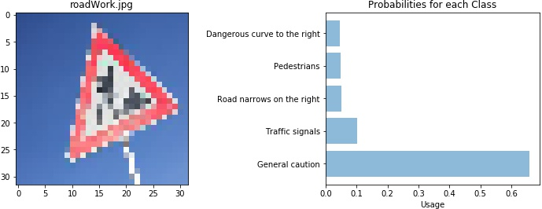

# **Traffic Sign Recognition** 

## Introduction
In this project I am going to build two model based in LeNet-5 architecture. The LeNet architecture was first introduced by LeCun et al. in their 1998 paper, . As the name of the paper suggests, the authors’ implementation of LeNet was used primarily for OCR and character recognition in documents. 

In self-driving cars technology, the time of processing data is very important so is necessary to make a trade-off between accuracy and training time. Therefore, I am going to compare the behavior of the models respects the type input data type. For that, In the first model (model1), I am going to feed the model with grayscale-normalize images input. I will record the accuracy to training, validation and test sets. Also, I will record the time required to train the model. In the second model, I will record the same features but the model would be feeding with RGB-normalize images input. Finally, I will take the models and I will test it with new images to get the better model to predict correctly these images.

**Build a Traffic Sign Recognition Project**

The goals / steps of this project are the following:
* Load the data set (see below for links to the project data set)
* Explore, summarize and visualize the data set
* Design, train and test a model architecture
* Use the model to make predictions on new images
* Analyze the softmax probabilities of the new images
* Summarize the results with a written report


[//]: # (Image References)

[image2]: ./examples/grayscale.jpg "Grayscaling"
[image3]: ./examples/random_noise.jpg "Random Noise"
[image4]: ./Images/60LimitSpeed.png "Traffic Sign 1"
[image5]: ./Images/DangerousCurveLeft.png "Traffic Sign 2"
[image6]: ./Images/Pederastians.png "Traffic Sign 3"
[image7]: ./Images/roadWork.jpg "Traffic Sign 4"
[image8]: ./Images/yield.png "Traffic Sign 5"

## Rubric Points
### Here I will consider the [rubric points](https://review.udacity.com/#!/rubrics/481/view) individually and describe how I addressed each point in my implementation.  

---

### Data Set Summary & Exploration

#### 1. Provide a basic summary of the data set. In the code, the analysis should be done using python, numpy and/or pandas methods rather than hardcoding results manually.

I used the numpy library to calculate summary statistics of the traffic
signs data set:

* The total data have a size of 51839 examples. This was make to subsets, training, validation and testing sets. 
* The size of training set is 34799 (~67%)
* The size of the validation set is 4410 (~9%)
* The size of test set is 12630 (~24%)
* The shape of a traffic sign image is 32 x 32 pixels (width and height)
* The number of unique classes/labels in the data set is 43 (0,...,42) 

#### 2.  Exploratory visualization of the dataset.

Here is an exploratory visualization of the data set. This is a subsample of the training data set. 

![alt text][image1]

In the distribution of the data set it was found that the first 10 classes have a significant proportion of the examples with respect to the others.


### Design and Test a Model Architecture 

To first model, I decided to convert the images to grayscale because I assume that the inputs with less size requires less processing time. Also, We could choose to collapse the RGB channels into a single gray-scale channel. There are often considerations to reduce other dimensions, when the neural network performance is allowed to be invariant to that dimension, or to make the training problem more tractable

Here is an example of a traffic sign image before and after grayscaling.

![alt text][image2]

As a last step, I normalized the image data because Data normalization is an important step which ensures that each input parameter (pixel, in this case) has a similar data distribution. This makes convergence faster while training the network. Data normalization is done by subtracting the mean from each pixel and then dividing the result by the standard deviation. In this case, I use other method wich consist to substract the minimun value and then dividing the result by the rest of max value minus minimun value.For image inputs we need the pixel numbers to be positive, so we might choose to scale the normalized data in the range (0,1) in order to avoid diying ReLu.

To the second model, I just applied normalization without dimensionality reducing (grayscale) in order to compare the processing time and performance.


#### Describe final model architecture.

My first model consisted of the following layers:

| Layer         		|     Description	        					| 
|:---------------------:|:---------------------------------------------:| 
| Input         		| 32x32x1 Grayscale image   					| 
| Convolution 5x5     	| 1x1 stride, valid padding, outputs 28x28x6 	|
| RELU					|												|
| Average pooling		| Size 2x2,	2x2 stride,outputs 14x14x6  		|
| Convolution 5x5     	| 1x1 stride, valid padding, outputs 28x28x6 	|
| RELU					|												|
| Max pooling   		| Size 2x2,	2x2 stride, 	outputs 5x5x6		|
| Flatten				| 							outputs 400 	 	|
| Fully connected		| 							outputs 120 	 	|
| RELU					|												|
| Dropout	 	   		| Probability 0.5		 	outputs 120 		|
| Fully connected		| 							outputs 84  	 	|
| RELU					|												|
| Dropout	 	   		| Probability 0.5		 	outputs 84  		|
| Fully connected		| 						outputs (labels)43	 	|

To the second model was built with the same architecture but the input was:

| Input         		| 32x32x3  RGB image        					| 


#### 3. Describe  trained  model. 

To train the model, I used an Adams optimizer with the following hyperparameters:
```python
EPOCHS = 40
BATCH_SIZE = 128
rate = 0.001
dropout = 0.5  # keep_prob for dropout layers
```

I took care to change ```dropout``` to 1.0 for validation and testing.
To see details about Adams optimizer algorithm, you can refer [!here](https://arxiv.org/pdf/1412.6980v7.pdf).

#### 4. Describe the approach taken for finding a solution and getting the validation set accuracy to be at least 0.93. Include in the discussion the results on the training, validation and test sets and where in the code these were calculated. Your approach may have been an iterative process, in which case, outline the steps you took to get to the final solution and why you chose those steps. Perhaps your solution involved an already well known implementation or architecture. In this case, discuss why you think the architecture is suitable for the current problem.

My final model results were:

* The first model (Grayscale inputs):
    * Training and validation accuracy:
    [Gray model](./examples/AccuracyGray.jpg)
    * Loss:
    [Gray model](./examples/LossGray.jpg)
    
|Model with gray inputs 	|
|:---------------------------------------:|
|Final train SET accuracy :	 0.99873559585| 
|Final validation SET accuracy :   	 0.979771679383| 
|Test SET accuracy:	 0.944975970609| 
|Test new images:	  0.4| 
|The training time:	 115|

* The first model (Grayscale inputs):
    * Training and validation accuracy:
    [Gray model](./examples/AccuracyRBG.jpg)
    * Loss:
    [Gray model](./examples/LossRGB.jpg)
    
|Model with gray inputs 	|
|:---------------------------------------:|
|Final train SET accuracy :	 0.998678122935| 
|Final validation SET accuracy :   	 0.98798185941| 
|Test SET accuracy:	 0.944975970609| 
|Test new images:	0.6| 
|The training time:	 146|
 

### Test a Model on New Images

Here are five German traffic signs that I have chosen on the web:

![alt text][image4] ![alt text][image5] ![alt text][image6] 
![alt text][image7] ![alt text][image8]

The first image might be difficult to classify because ...

Next, I choose test the RGB model since that has better validation accuracy. The outcomes are shown in the next images:
    
    
    
    
    

The model was able to correctly guess 3 of the 5 traffic signs, which gives an accuracy of 60%. This compares badly to the accuracy on the test set of 94%. The bad prediction probably is due to bad feeding of traning set. 

## Conclusion

The difference in time between the models was 30 seconds being the gray model most quickly to train. However, predicting new images was found that the RGB model has more accuracy ( One image more). The models don't present overfitting or underfitting since the validation and training accuracy was close to each other. 


